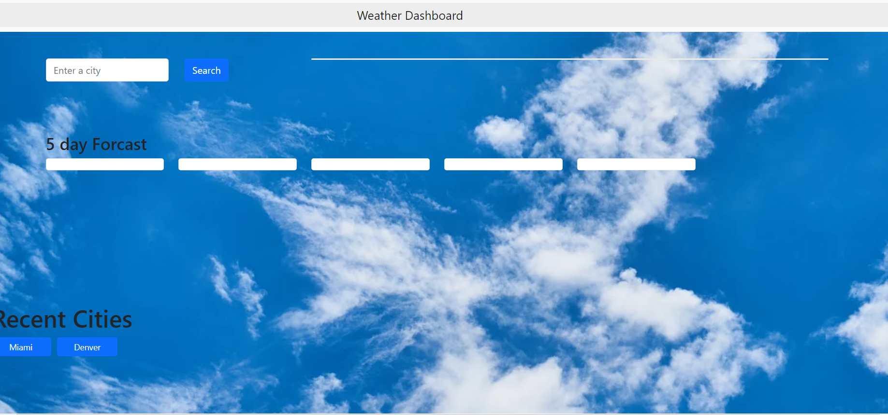
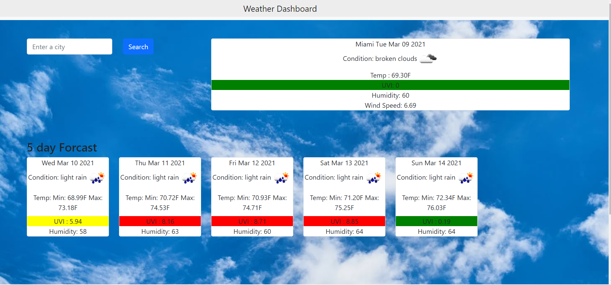
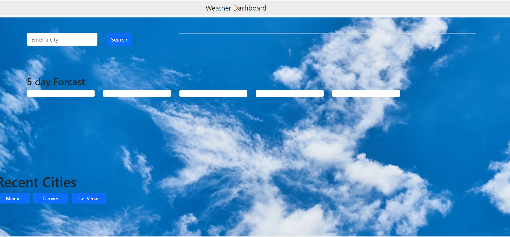

# Weather-Planner

### Weather Planner

## Table of Contents 

[Description](#description)

[Languages Used](#languages_used)

[Libraries](#libraries)

[Screenshots](#screenshots)

[Link to deployed app](#link)

[Questions](#questions)

## Description 

With this application, the user is presented with a webpage that allows them to look up the weather for any city they choose. When the user searches for the city, they see a section that presents them with current weather information. They will also be presented with a 5 day forecast of the same city. Also the cities will be saved into local storage. The cities will also be rendered into buttons for data persistence and for easy access for user to view a previously searched city weather information again.

## Languages Used

HTML, CSS and Javascript 

## Libraries 

Bootstrap, Jquery, Open Cage Data and Open Weather 

## Screenshots

## Link for Deployed App

[Link for Deployed Application](https://lavina91.github.io/Weather-Planner/.)